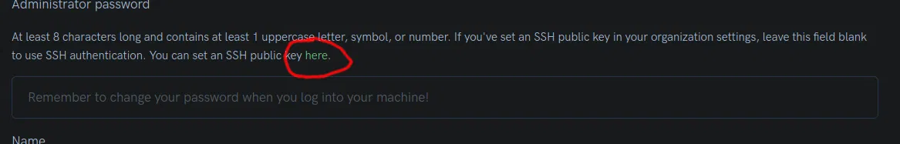

# Tensordock Server for AI Generation/Training
- Tutorial on how to setup a server on Tensordock for AI Image generation or Model training
- First wrote it on [rlim](https://rlim.com), but github has is easier with markdown and I can edit it in the future so, here we are
---
## This is a guide on how to setup a server for AI (That I use)
- Navigation
  - [Preparation](#preparation)
  - [Server Preparation](#server-preparation)
  - [UI Preparation](#ui-preparation)
    - [Commands used (For Non-Linux Users)](#some-commands-we-will-be-using)
    - [A1111 & Forge](#a1111--forge)
    - [ComfyUI](#comfyui)
    - [Kohya_SS](#kohya_ss)
    - [Ease of Use for UIs](#ease-of-use-for-uis)
- General Information
  - Hosting
    - Finding a good hosting for AI can be quite an issue generally. You can have something like GCS (Google Cloud Services) with many features, but it will be expensive. Or you can go for something like runpod which is mostly specified for AI.
    - Since I like having control of the operating system and I'm quite cheap, I went the option of Tensordock where you don't have that much customizability as on GCS, but you have full control of the OS unlike runpod. (I am not sponsored by Tensordock, I use it because I like it)
  - Operating System
    - I'm going to show steps on how to setup Ubuntu 22.04 for AI, since that's the easiest and the one that Tensordock provides. It also provides Windows Server, but I don't have good experience with that one.
    - I will go through all you need to install and most likely want to install for simplicity, the commands will be shown alongside the steps.

### Okay that's it for the introduction, let's get into it.

1. ### **Preparation**
   1. Create an Account on [Tensordock](https://marketplace.tensordock.com) and create your Organization (It is nothing paid, It's just for users who want their account to be used by multiple people)
   2. Go to **Your Organization** section and deposit some funds, even the minimum 5$ is enough for start.
   3. Now go into your console (On Windows use [Terminal](https://apps.microsoft.com/detail/9n0dx20hk701) or CMD)
      1. We're going to generate a ssh key file for your machine, so you don't need to login every time you use it.
      2. type `ssh-keygen -f <location-where-you-want-to-save-it>/<name-of-the-key> -t rsa -b 4096`
         1. The location of the file should be generally at `~/.ssh` for Linux users and `C:\Users\<Your-Name>\.ssh` for Windows users.
         2. I like to keep the key name simple, mostly just **tensordiffusion**, but you can name it whatever you want
         3. **Windows specific info:** The dividers between directories in a console is different between the OS's, on linux we use a frontslash, on windows it is a backslash
         4. Press enter and your file will be generated where you specified
   4. Go back to your browser and open **New Cloud GPU**
      1. Now, select a GPU based on your financial status (how much do you want to spend on a server)
         1. I usually go for A4000 for Generation and A5000 or higher for Training
      2. Specify your system resources
         1. One GPU is enough
         2. Use at least 32GB of RAM
         3. At least 8 CPU vCores
         4. And use at minimum like 150GB of storage (you can go wild, it is quite cheap)
      3. Select a location where you want your server
         1. Pricier location have better transfer speeds and more GPUs (If you turn off a server and disassociate a GPU, it can be used up by someone else)
         2. Cheaper ones have less GPUs and sometimes worse transfer speeds (I mean internet)
      4. Select **Ubuntu 22.04 LTS**
      5. Now let's use your ssh key
         1. Open the key file with `.pub` extension in a text editor and Ctrl+A copy everything inside (on linux just use `cat` and copy the output \[.pub files are the public files which are supposed to be on a server, the file with no extension is a private file which should be on your computer. Do NOT share the private key file.\]
         2. Click on the text show in the image and a popup will emerge, in there you will enter your public key, press update and close the popup 

            
      6. Type in the name of your server
      7. Specify a port you want to open
         1. The 5 digit number is the outside port (you will be typing these in your browser later), The 4 digit and less are the internal ports (7860 is used by SD Webui as a port).
         2. Open at least one more port of your choosing, if you choose random number we will fix that later.
      8. Click **Deploy Server** and you're done. You've successfully deployed an Ubuntu server.
2. ### **Server Preparation**
   1. Prepare a file from which you can run the server easily.
      1. The file will look like this: `ssh -i <path-to-the-file> -p <ssh-port> user@<server-ip>`
         1. The path to the file will be `~/ssh/<filename>` on linux and `C:\Users\<username>\.ssh\<filename>` on Windows (Please use the private key for this
         2. The server ip can be found under your server's settings
         3. The port can be found under the ip address (the 5digit one that assigned to internal port 22)
      2. Save the file with extension `.bat` on windows or `.sh` on linux
         1. On linux you will also need to `chmod +x <file>` to make it executable
      3. Windows users can just double-click the file to log-in, linux users run it through the console (as per usual)
   2. Once connected to the server you will run these commands (On linux you paste into a console by Ctrl+Shift+V, because Ctrl by itself is used in different ways ex. Ctrl+C stops the command you have run)
      1. `sudo apt update && sudo apt upgrade -y` | Check for packages that can be updated and update them without asking
      2. `sudo apt install -y python3 python3-pip python3-venv python3-tk git wget google-perftools zip unzip` | Install python and all the dependencies for webui's
      3. Download the repositories of the WebUI's you will be using
         1. A1111-WebUI - `git clone https://github.com/AUTOMATIC1111/stable-diffusion-webui.git`
         2. ComfyUI - `git clone https://github.com/comfyanonymous/ComfyUI.git`
         3. SD-WebUI-Forge - `git clone https://github.com/lllyasviel/stable-diffusion-webui-forge.git`
         4. Kohya_SS - `git clone https://github.com/bmaltais/kohya_ss.git`
   3. Let's open up the firewall
      1. `sudo ufw allow ssh` | ufw (Universal Firewall) allow running ssh port (port 22)
      2. `sudo ufw allow <port>` | run this for the ports you specified and the port 8888 (as a backup)
      3. `sudo ufw enable` | It will ask you if you are sure, select yes unless you haven't allowed ssh. If you run this and you haven't allowed ssh, your ssh connection will break and you will not be able to connect to the server.
   4. **(Optional) Install software for helping you keep track of the system and manage files**
      1. btop (also know as bashtop)
         1. It is from the family of **top** software/cli utilities, which are essentially system monitors
         2. `git clone https://github.com/aristocratos/btop.git` | We're gonna build it from source to get GPU support
         3. `cd btop` | learn this command, it is a **Change Directory** command, to go back from a directory use `cd ..`
         4. `make` | this will build all the files from the source
         5. `sudo make install` | this will install the software to the system
         6. Then you can run it just by typing `btop` into the console. Please run it alongside your AI session in a New Window/Tab/Split.
      2. dust (file tree and file size cli utility)
         1. Just install it through snap (a package manager for Linux, which is generally bad but for this it is enough) `sudo snap install dust`
         2. Run it with `dust` in a directory
         3. Advanced users may install it through Homebrew or build it from source, but that complication is not needed in this guide
   5. On your **HOME PC** install [Filezilla Client](https://filezilla-project.org/download.php?type=client), for easier access to files on the server through SFTP (Secure/SSH File Transfer Protocol)
      1. After installing it, open it 
      2. In the top-left corner under the menu bar (under **File**) click on the first Button/Icon which opens the Site Manager
      3. Click **New Site**
         1. For protocol select SFTP
         2. For Host, it is the IP Address of your server
         3. For Port, it is the SSH port
         4. Change Logon type to **Key File**
         5. User is just "user"
         6. And key file is just your private ssh key file
      4. After this you can connect and browse/upload/download files from your server easily
3. ### **UI Preparation**
   **(Do NOT copy the commands whole, try to write them yourself alongside this guide, I will prompt you when you can copy fully)**
   1. #### Some commands we will be using
      1. `cd ~` - change directory to home, `cd ..` - change directory to level above, `cd <dir>` - change directory to what you specify
      2. `git clone` - clone a github repository, `git pull` - update a cloned repository
      3. `echo "something"` - print text to console, `echo "something" >> <file>` - append/add text to a file
      4. You can use the tab key to autocomplete paths in the console, ex. `cd stab + <TAB> -> cd stable-diffusion-webui` 
      5. `chmod +x <file>` - change file's mode/permissions, `+x` allow file to be executed
      6. You can stop a command you ran by pressing `CTRL+C`
   2. #### A1111 & Forge
      1. ```bash
         cd ~
         git clone https://github.com/AUTOMATIC1111/stable-diffusion-webui.git # for A1111 WebUI
         git clone https://github.com/lllyasviel/stable-diffusion-webui-forge.git # for Forge
         cd stable-diffusion-webui # or cd stable-diffusion-webui-forge
         # You can copy the echo command, it is just for convenience sake
         echo 'SCRIPT_DIR=$( cd -- "$( dirname -- "${BASH_SOURCE[0]}" )" &> /dev/null && pwd )' >> ./start.sh
         echo "$SCRIPT_DIR/webui.sh --xformers --listen --port 7860 --enable-insecure-extension-access" >> ./start.sh # You can specify the port you want
         #If you are using forge and have 16GB+ VRAM you can add "--cuda-malloc --cuda-stream --pin-shared-memory --enable-insecure-extension-access" arguments, there may be a speedup
         chmod +x start.sh
         ./start.sh
         ```
      2. If the `--enable-insecure-extension-access` argument causes errors for some reason, do `nano start.sh` (nano is commandline text editor), </br>
      navigate with your arrow keys to the argument and just remove it. Save the file by `CTRL+S` and `CTRL+X`, in that order. </br>
      Now you cannot install extension inside the UI as `--listen` blocks that and since `--enable-insecure-extension-access` gives errors, </br>
      if you want to install an extension, you will need to go to the extension directory and clone the repository of the extension there.
         - example:
           ```bash
           cd extensions
           git clone https://github.com/adieyal/sd-dynamic-prompts.git
           ```
   3. #### ComfyUI
      1. ```bash
         # This can be fully copied
         cd ~
         git clone https://github.com/comfyanonymous/ComfyUI.git
         cd ComfyUI/
         cd custom_nodes/
         git clone https://github.com/ltdrdata/ComfyUI-Manager.git # With manager you can install custom nodes even on the server
         cd ..
         python3 -m venv venv
         source venv/bin/activate
         pip install -r requirements.txt
         pip install torch torchvision torchaudio --extra-index-url https://download.pytorch.org/whl/cu121
         echo 'SCRIPT_DIR=$( cd -- "$( dirname -- "${BASH_SOURCE[0]}" )" &> /dev/null && pwd )' >> ./start.sh
         echo "$SCRIPT_DIR/venv/bin/python $SCRIPT_DIR/main.py --listen 0.0.0.0 --port 7860" >> ./start.sh # You can specify the port you want
         chmod +x start.sh
         deactivate
         ./start.sh
         ```
   4. #### Kohya_SS
      1. Install Nvidia CUDA Toolkit
         - Go to this url [https://developer.nvidia.com/cuda-downloads](https://developer.nvidia.com/cuda-downloads?target_os=Linux&target_arch=x86_64&Distribution=Ubuntu&target_version=22.04&target_type=deb_local)
         - Copy the **Base Installer** contents and run them in your server console
         - Example: (for CUDA Toolkit 12.5)
            ```bash
            wget https://developer.download.nvidia.com/compute/cuda/repos/ubuntu2204/x86_64/cuda-ubuntu2204.pin
            sudo mv cuda-ubuntu2204.pin /etc/apt/preferences.d/cuda-repository-pin-600
            wget https://developer.download.nvidia.com/compute/cuda/12.5.0/local_installers/cuda-repo-ubuntu2204-12-5-local_12.5.0-555.42.02-1_amd64.deb
            sudo dpkg -i cuda-repo-ubuntu2204-12-5-local_12.5.0-555.42.02-1_amd64.deb
            sudo cp /var/cuda-repo-ubuntu2204-12-5-local/cuda-*-keyring.gpg /usr/share/keyrings/
            sudo apt-get update
            sudo apt-get -y install cuda-toolkit-12-5
            ```
         - **If it fails to run later, sometimes it does this, try running this then** `sudo apt install nvidia-cuda-toolkit`
      2. Install Nvidia cuDNN
         - Go to this url [https://developer.nvidia.com/cudnn-downloads](https://developer.nvidia.com/cudnn-downloads?target_os=Linux&target_arch=x86_64&Distribution=Ubuntu&target_version=22.04&target_type=deb_local)
         - Copy the **Installation Instructions** and run them aswell
         - Example:
            ```bash
            wget https://developer.download.nvidia.com/compute/cudnn/9.2.0/local_installers/cudnn-local-repo-ubuntu2204-9.2.0_1.0-1_amd64.deb
            sudo dpkg -i cudnn-local-repo-ubuntu2204-9.2.0_1.0-1_amd64.deb
            sudo cp /var/cudnn-local-repo-ubuntu2204-9.2.0/cudnn-*-keyring.gpg /usr/share/keyrings/
            sudo apt-get update
            sudo apt-get -y install cudnn
            ```
      3. Export CUDA to path permanently
         - ```bash
            echo 'export PATH=/usr/local/cuda/lib64:$PATH' >> ~/.bashrc
            echo 'export LD_LIBRARY_PATH=/usr/local/cuda/lib64' >> ~/.bashrc
            echo 'export CUDA_PATH=/usr/local/cuda' >> ~/.bashrc
            exec bash # Reloading the console without restarting the system
            ```
      4. Install Kohya_SS
         - ```bash
            cd ~
            git clone https://github.com/bmaltais/kohya_ss.git
            ./setup,sh
            echo 'SCRIPT_DIR=$( cd -- "$( dirname -- "${BASH_SOURCE[0]}" )" &> /dev/null && pwd )' >> ./start.sh
            echo '$SCRIPT_DIR/gui.sh --listen 0.0.0.0 --server_port 7860 --headless' >> ./start.sh # The server port can be changed to what you need
            chmod +x start.sh
            ./start.sh
            ```
   5. #### Ease of Use for UIs
      - Create aliases for running the different UIs
         - As you have seen before, the `export` command does export to a path (environment variables on Windows)
         - We are now gonna use the `alias` command (This is the reason for the SCRIPT_DIR echo, without it this wouldn't work)
         - ```bash
            echo 'alias webui=/home/user/stable-diffusion-webui/start.sh' >> ~/.bashrc # Example for A1111
            echo 'alias forge=/home/user/stable-diffusion-webui-forge/start.sh' >> ~/.bashrc # Example for Forge
            echo 'alias comfyui=/home/user/ComfyUI/start.sh' >> ~/.bashrc # Example for ComfyUI
            echo 'alias kohya=/home/user/kohya_ss/start.sh' >> ~/.bashrc # Example for Kohya_SS
            exec bash # Reload console/bash config
            ```
         - You can change the alias names to your liking (alias name are this `alias <name>=/)
         - If you set what you want, now you can just run ex. `webui` as a command to start the UI
## We are DONE - Thank You for Reading
- If you have any questions/suggestion, open an Issue
